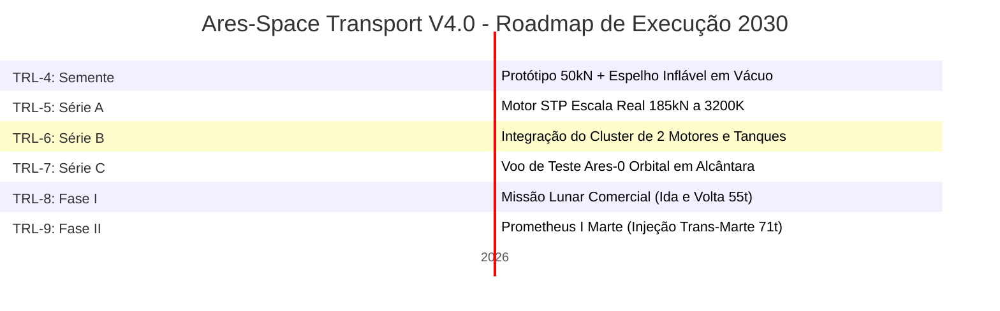

# ARES-SPACE TRANSPORT V4.0 — TECHNICAL ROADMAP
**Plano de Voo: TRL-4 → TRL-9 | Horizonte: 2030 | Programa Comercial de Alto Custo-Benefício | Base: Alcântara, Brasil**

> Filosofia de Projeto: Desenvolvimento ágil focado em hardware, livre de restrições burocráticas/radioativas e 100% focado em mercado.

## 1. Resumo dos Portões TRL — Cluster Dinâmico 2x STP

| TRL | Marco Operacional | Duração | Orçamento (CAPEX) | Entregável Crítico (Key Deliverable) | Critério de Saída / Portão (Gate) |
| --- | --- | --- | --- | --- | --- |
| **TRL-4** | **Demonstrador de Laboratório** | 0-18 meses | **$22M** | Prototipagem da câmara $Ta_4HfC_5$ (50kN) + teste de inflamento de espelho de Mylar em vácuo. | Validação de $I_{sp}$ de 620s com Metano. **Seed → Series A** |
| **TRL-5** | **Motor em Escala Real** | 18-36 meses | **$65M** | Motor STP real de 185kN + Turbobombas de Metano a 15 kg/s. Teste de fluxo contínuo a 3200 K. | Qualificação estrutural e revestimento de Irídio. **Series A → B** |
| **TRL-6** | **Teste de Estágio Integrado** | 36-48 meses | **$180M** | Acoplamento do cluster de 2 motores STP nos tanques Al-Li de 9m. Teste estático longo em Alcântara. | Disparo integrado com controle de vetorização (TVC). **Series B → C** |
| **TRL-7** | **Demonstração Orbital** | 48-60 meses | **$450M** | **Ares-0 (Não-tripulado)** lançado de Alcântara. Implantação dos espelhos em órbita e 8 queimas em LEO. | Validação espacial do sistema Zero Boil-Off (ZBO). **Series C → Gov** |
| **TRL-8** | **Certificação e Fase I** | 60-72 meses | **$780M** | **Fase I (Missão Lunar)** operacional. Transporte de 55t para órbita lunar e retorno autônomo. | Homologação de voo humano alcançada. **Contrato Assinado** |
| **TRL-9** | **Fase II: Prometheus I** | 72-84 meses | **$950M** | **Fase II (Missão Marte)**. Lançamento de 6 tripulantes de Alcântara. Trânsito rápido e injeção de 71t (TMI). | **Sucesso da Missão. Programa Comercial Líder.** |

**Custo Total do Programa: $2.44B | Janela de Execução: 7 Anos (Meta 2030) | Capacidade Lunar: 55t | Capacidade Marte: 71t**

## 2. Rodada Semente (Seed Round): Divisão dos $22M (TRL-4) — 18 Meses

| Categoria | Investimento (USD) | Descrição Detalhada de Engenharia |
| --- | --- | --- |
| **Equipe Técnica (16 FTE x 18mo)** | $7.0M | 4 Engenheiros de Propulsão STP, 4 Térmicos/Criogenia, 2 GNC, 2 Estruturas, 2 Software, 2 Gerentes |
| **P&D Metalúrgico ($Ta_4HfC_5$ + Irídio)** | $4.0M | Fornos de alta temperatura (3500K), deposição atômica de película de Irídio contra corrosão. |
| **Prototipagem STP Subescala (50kN)** | $3.5M | Vasos de pressão de bocal Aerospike linear, tubulações inertes e instrumentação térmica fina. |
| **Mecanismo de Espelho Inflável** | $3.0M | Desenvolvimento das membranas de Mylar aluminizado de $1250 \text{ m}^2$ e testes de inflamento em vácuo. |
| **Infraestrutura e Bancada de Testes** | $2.2M | Adaptação de bancada em Alcântara/CLA com linhas de suprimento estáveis de metano líquido criogênico. |
| **Assessoria Regulatória e AEB** | $1.2M | Protocolos de licenciamento ambiental ágil para propelentes verdes (livre de amarras nucleares). |
| **Contingência Operacional (10%)** | $1.1M | Margem de segurança para oscilações no preço de materiais e engenharia de hardware. |
| **TOTAL** | **$22M** | **Entregável: Disparo de 30s do motor STP + Desdobramento do espelho parabólico em câmara de vácuo.** |
## 3. Portões Técnicos Críticos e Mitigações — V4.0

Desafios sistêmicos eliminados ou mitigados na nova versão:

1. **Eficiência Óptica**: Perda de foco ou rugosidade nos espelhos infláveis de Mylar derrubam a temperatura da câmara. Mitigation: Sistema de pressurização dinâmica automatizado pela IA ODIN.
2. **Corrosão Química por Carbonização**: Escoamento de metano superaquecido a 3200 K desgasta ligas metálicas comuns. Mitigation: Revestimento de Irídio (inerte) sobre matriz cerâmica de Carboneto de Tântalo-Háfnio.
3. **Gerenciamento Elétrico do ZBO**: Falha no suprimento elétrico dos crio-resfriadores causa evaporação (*boil-off*). Mitigation: Manta híbrida de isolamento de 60 camadas de Mylar com Aerogel de Sílica de alta retenção passiva.
4. **Acoplamento de Espelhos**: Dinâmica vibracional e arrasto na atmosfera residual de LEO danificam as parábolas. Mitigation: Desdobramento exclusivo acima de 400 km após estabilização de atitude.
5. **Redundância Propulsiva**: Perda de um motor compromete a inserção. Mitigation: Arquitetura de 2 motores independentes. A perda de 1 unidade permite o cumprimento da rota estendendo o tempo de queima via redundância 1/2.

## 4. Estratégia de Mercado e Financiamento (Go-To-Market)

| Fase | Linha de Tempo | Fonte de Financiamento | Aporte Estimado | Objetivo Comercial Estratégico |
| --- | --- | --- | --- | --- |
| **Início** | Anos 1-3 | Rodada Seed Privada + Bolsas AEB/FINEP | $22M Privados + $15M Não-dilutivos | De-risking completo do motor STP e validação da metalurgia anticorrosão. |
| **Meio** | Anos 3-5 | Contratos Comerciais de Lançamento | $450M | Financiamento do Ares-0 uncrewed orbital demo focado no mercado de satélites pesados. |
| **Fim** | Anos 5-7 | Operação Comercial Fase I (Lua) | $320M por rota logística | Atendimento ao mercado cislunar transportando habitats e insumos pesados para a base lunar. |

## 5. Cronograma Geral do Programa (Timeline — 2x STP Methane)

